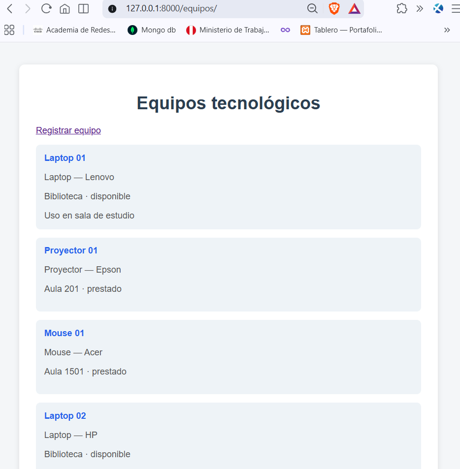
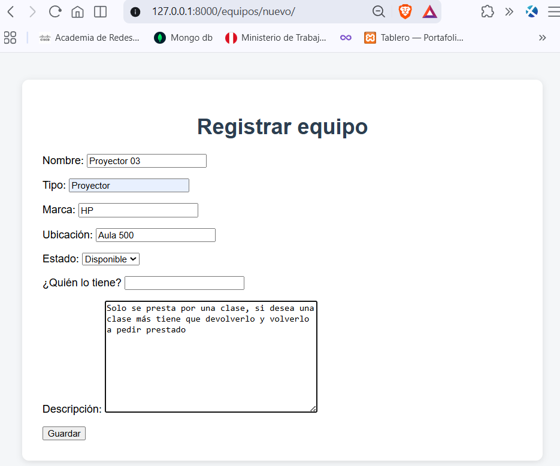
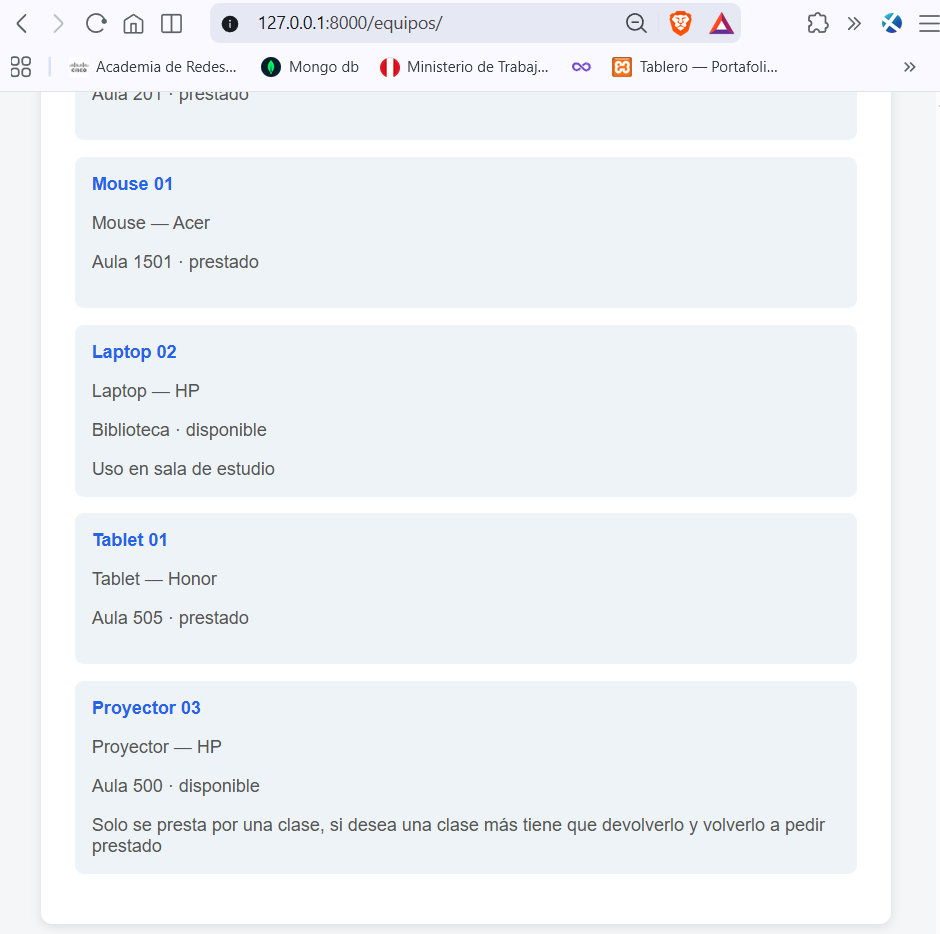

# Préstamo de equipos tecnológicos — Django

Laboratorio Semana 02. Desarrollo de Aplicaciones Empresariales (sección D).

- **Project:** `config`
- **Apps:** `core` (semana 01) y `equipment` (esta semana)
- **Repositorio del curso:** https://github.com/iam1shel/Desarrollo_Aplicaciones_Empresariales_D

---

## 1. Documento de requisitos

### Problemática (Ejercicio 1)

En una institución educativa el préstamo de laptops, proyectores y otros
equipos se registra a mano. Cuesta saber qué está disponible y quién lo tiene,
y eso genera pérdidas, retrasos y confusión en las devoluciones.
La aplicación web permite registrar equipos, préstamos y devoluciones.
La usan estudiantes, docentes y el personal encargado de los equipos.

### Requisitos funcionales (Ejercicio 2)

1. El sistema debe permitir registrar equipos tecnológicos.
2. El sistema debe permitir registrar un préstamo de equipo.
3. El sistema debe permitir registrar la devolución de un equipo.
4. El sistema debe actualizar el estado del equipo entre disponible y prestado.
5. El sistema debe permitir consultar el listado de equipos disponibles.
6. El sistema debe permitir consultar quién tiene un equipo prestado.

---

## 2. Diseño del modelo de datos (Ejercicio 3)

**Entidad principal:** `Equipo`

| Campo | Tipo de dato | ¿Obligatorio? | Justificación |
|---|---|---|---|
| id | Entero | Sí | Identifica de forma única cada equipo |
| nombre | Texto | Sí | Cómo identificamos el equipo (“Laptop 01”) |
| tipo | Texto | Sí | Qué clase de equipo es: laptop, proyector, mouse, tablet |
| marca | Texto | Sí | Quién lo fabricó (Lenovo, HP, Epson) |
| ubicacion | Texto | Sí | Dónde se encuentra cuando está disponible |
| estado | Texto | Sí | `disponible` o `prestado` |
| descripcion | Texto | No | Características o información adicional |
| prestado_a | Texto | No | Quién tiene el equipo (requisito de préstamo) |

Diferencia entre nombre, tipo y marca: el nombre es la etiqueta del ejemplar
(`Laptop 01`), el tipo es la clase (`Laptop`) y la marca es el fabricante (`Lenovo`).

En esta semana los datos viven en una lista en `models.py` (sin migraciones ni
base de datos). Al reiniciar el servidor, los registros agregados por el
formulario se pierden. Esto es esperado.

---

## 3. App creada: `equipment`

Archivos de la App:

- `equipment/models.py` — clase `Equipo` y lista estática `equipos` (mínimo 5 registros)
- `equipment/views.py` — `equipo_list` y `equipo_create`
- `equipment/urls.py` — rutas del listado y del formulario
- `equipment/forms.py` — `EquipoForm` (`forms.Form`, no ModelForm)
- `equipment/templates/equipment/equipo_list.html` — listado
- `equipment/templates/equipment/equipo_form.html` — formulario de creación

URLs:

- Listado: `http://127.0.0.1:8000/equipos/`
- Registro: `http://127.0.0.1:8000/equipos/nuevo/`
- Catálogo `core` (semana 01): `http://127.0.0.1:8000/`

---

## 4. Requisitos de software e instalación

- Python
- Django 5.2.17 (`requirements.txt`)

```bash
python -m venv venv
venv\Scripts\activate
pip install -r requirements.txt
cd src
python manage.py runserver
```

---

## 5. Capturas del flujo funcionando

### 5.1 Listado de registros

GET `http://127.0.0.1:8000/equipos/`

Se ven los equipos estáticos (Laptop 01, Proyector 01, Mouse 01, Laptop 02, etc.) y el enlace **Registrar equipo**.



### 5.2 Formulario de creación

GET `http://127.0.0.1:8000/equipos/nuevo/`

Formulario `EquipoForm` con los campos del ejercicio 7. En la prueba se registró **Proyector 03** (HP, Aula 500, disponible).



### 5.3 Nuevo registro reflejado en el listado

Después de Guardar, Django redirige a `/equipos/`. Al final aparece **Proyector 03**.



---

## 6. Flujo MVT aplicado a este caso (Ejercicio 9)

Un Project de Django es el contenedor (`config`). Dentro conviven varias Apps.
`core` es el catálogo de items de la semana 01.
`equipment` es el préstamo de equipos de esta semana.
Ambas están en `INSTALLED_APPS` y cada una tiene su propia URL.

### Listado: Request → URL → View → Model → Template → Response

1. **Request.** El navegador pide GET `http://127.0.0.1:8000/equipos/`.
2. **URL.** `config/urls.py` ve el prefijo `equipos/` y pasa a `equipment/urls.py`.
   Ahí `path('', ...)` llama a la vista `equipo_list`.
3. **View.** `equipo_list` en `equipment/views.py` toma la lista `equipos`.
4. **Model (datos estáticos).** No hay base de datos: los datos están en
   `equipment/models.py` (clase `Equipo` + lista `equipos`).
5. **Template.** Se renderiza `equipment/equipo_list.html`, que hereda de `base.html`.
6. **Response.** Django devuelve el HTML y el navegador muestra las tarjetas.

### Crear y volver al listado

1. **Request.** GET `/equipos/nuevo/` abre el formulario (`equipo_create` + `equipo_form.html`).
2. Al guardar, el navegador envía **POST** con los campos.
3. **View.** `equipo_create` valida con `EquipoForm`. Si está bien, hace
   `equipos.append(...)` (se agrega en memoria) y `redirect("equipo_list")`.
4. **Response.** El navegador carga otra vez `/equipos/` y el dato nuevo aparece.

### Cómo convive `equipment` con `core` en el mismo Project

| | core | equipment |
|---|---|---|
| Tema | Catálogo de items | Préstamo de equipos |
| URL | `/` | `/equipos/` y `/equipos/nuevo/` |
| Datos | Modelo `Item` (SQLite) | Lista `equipos` en memoria |
| Archivos | `src/core/` | `src/equipment/` |

El Project (`config`) las une: las registra en `INSTALLED_APPS` y las enruta en
`config/urls.py`. No se pisan porque cada app tiene su prefijo de URL.
`equipment` reutiliza `base.html` y el CSS de `core` (``).

---

## 7. Evidencia por integrante

### Mishel Rojas

- **Nombre:** Mishel Rojas
- **Título:** Implementación de la App `equipment` (préstamo de equipos tecnológicos)
- **Qué hizo:** App Django con datos estáticos, listado, formulario de creación,
  URLs, registro en `INSTALLED_APPS` y documentación del flujo MVT.
- **Código:** `src/equipment/` (`models.py`, `views.py`, `urls.py`, `forms.py`, templates)
- **Explicación:** La vista `equipo_list` recorre la lista en memoria y la pinta
  en el template. `equipo_create` muestra `EquipoForm`, valida el POST, agrega
  un `Equipo` a `equipos` y redirige al listado.
- **Capturas:** ver sección 5.
- **Casos de prueba:**

| # | Qué hago | Qué espero | Resultado |
|---|---|---|---|
| 1 | Abro `/equipos/` | Veo al menos 5 equipos | Cumplido (captura 5.1) |
| 2 | Clic en Registrar equipo | Sale el formulario | Cumplido (captura 5.2) |
| 3 | Envío el formulario vacío | Django no deja guardar (campos obligatorios) | — |
| 4 | Lleno el formulario y Guardar | Vuelvo al listado y aparece el nuevo equipo | Cumplido: Proyector 03 (captura 5.3) |
| 5 | Reinicio `runserver` y recargo | El registro nuevo desaparece (lista en memoria) | Esperado |
| 6 | Abro `/` | Sigue el catálogo de `core` | — |
